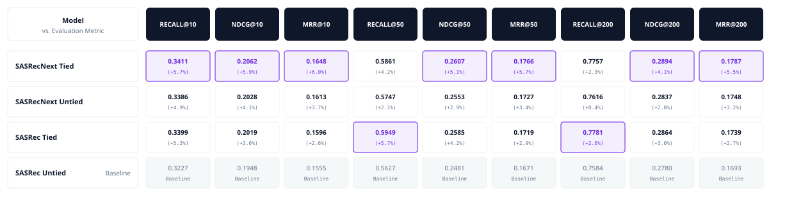
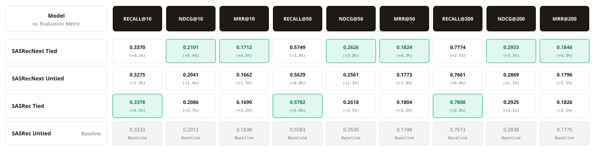
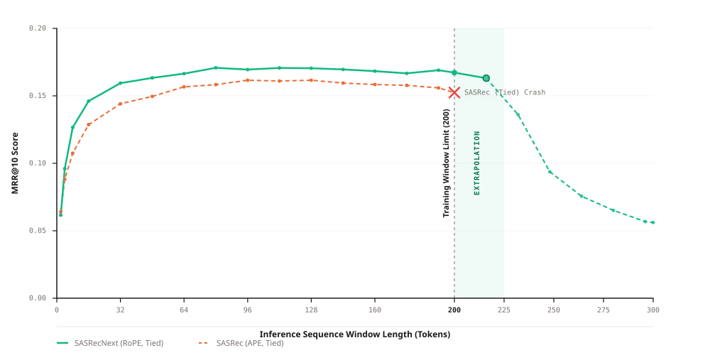
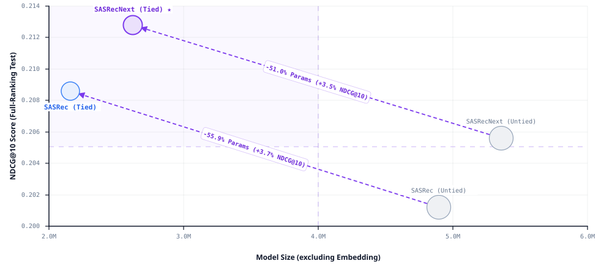

# SASRecNext Engine

<div align="center">
  <p>A modular benchmarking engine for sequential recommendation.<br>Compares SASRec and SASRecNext on MovieLens (1M / 10M).</p>
</div>

## Declaration

This repository is created for educational purposes. **I do not encourage or promote watching movies.** The MovieLens dataset is used strictly because it's a standard benchmark in recommendation systems research.

## Why SASRecNext?

Standard SASRec works. It's a solid baseline. But it has two weaknesses that show up fast on real-world workloads: parameter bloat on large catalogs, and a hard ceiling on sequence length.

SASRecNext fixes both.

**Weight Tying** reuses the item embedding matrix as the output projection layer. This cuts the parameter count significantly — on ML-10M with ~10K items, the savings are substantial. It also acts as a regularizer: fewer parameters means less room to overfit. The idea comes from [Press & Wolf (2017)](https://arxiv.org/abs/1608.05859).

**Rotary Position Embeddings (RoPE)** replace the fixed absolute positional embeddings. Standard SASRec learns a position embedding table of size `max_seq_len` — feed it a longer sequence and it crashes. RoPE encodes position through rotation in the complex plane, so the model can handle sequences it's never seen during training. It won't be perfect on 10x-length inputs, but it degrades gracefully instead of breaking. See [Su et al. (2021)](https://arxiv.org/abs/2104.09864).

On top of these two changes, SASRecNext swaps in a modernized transformer stack:

- **RMSNorm** instead of LayerNorm — drops the mean-centering step for faster normalization ([Zhang & Sennrich, 2019](https://arxiv.org/abs/1910.07467))
- **SwiGLU** feed-forward layers — gated linear units with swish activation ([Shazeer, 2020](https://arxiv.org/abs/2002.05202))
- **Full-Softmax Cross Entropy** — no negative sampling; the loss is computed over the entire item catalog, consistent with modern generative recommender approaches

## Evaluation Results

All models are trained and evaluated with **full-ranking evaluation** and **history masking**. No sampled metrics — every item in the catalog is scored and ranked.

### MovieLens-1M

Four model variants compared: SASRec and SASRecNext, each with tied and untied output weights.

<div align="center">
  
</div>

### MovieLens-10M

<div align="center">
  
</div>

<div align="center">
  
</div>

<div align="center">
  
</div>

## Data Processing & Evaluation Protocol

The engine handles data end-to-end: download, preprocess, split, train, evaluate.

**Download.** Raw MovieLens data is pulled automatically from [GroupLens](https://grouplens.org/datasets/movielens/) the first time you run training or evaluation.

**ID Remapping.** MovieLens movie IDs are sparse (they skip numbers). The preprocessor remaps them to contiguous integers starting at 1, with 0 reserved for padding.

**Chronological Leave-One-Out Split.** Each user's interaction history is sorted by timestamp, then split:

- **Train:** all interactions except the last two — `seq[:-2]`
- **Validation:** the second-to-last interaction — `seq[-2]`
- **Test:** the final interaction — `seq[-1]`

Users with fewer than 3 interactions are dropped.

**Training Strategy.** Long user sequences are chunked using an overlapping sliding window (default stride: 150), so no historical transitions are lost to truncation. A final window always covers the tail of each user's history.

**Full-Ranking Evaluation.** At evaluation time, the model scores every item in the catalog for each user. Items the user has already interacted with are masked to `-inf` so they can't appear in the ranked list. This ensures recommendations are always novel.

**Metrics.** Recall@K, NDCG@K, and MRR@K, with K ∈ {10, 20, 50, 200}.

## Getting Started

### Prerequisites

- Python 3.12+
- [`uv`](https://docs.astral.sh/uv/) package manager

### Install

```bash
uv sync
```

### Train

```bash
uv run python scripts/train.py --config configs/ml-1m/sasrecnext_tied.yaml
```

This downloads the dataset if it's not already there, preprocesses it, trains the model with early stopping, and runs test evaluation when training finishes. The best checkpoint is saved to `checkpoints/<dataset>/<config_name>/`.

### Evaluate

```bash
uv run python scripts/eval.py --config configs/ml-1m/sasrecnext_tied.yaml
```

If the checkpoint doesn't exist locally, it's downloaded from GitHub Releases automatically.

You can also choose which split to evaluate:

```bash
uv run python scripts/eval.py --config configs/ml-1m/sasrecnext_tied.yaml --eval_set both
```

### Long-Sequence Extrapolation

```bash
uv run python scripts/eval_sequences.py --config configs/ml-1m/sasrecnext_tied.yaml
```

This evaluates the model across a sweep of context window sizes (2, 4, 8, ... up to 300) on users with long histories. It's what reveals RoPE's ability to handle sequences beyond the training window — and where standard SASRec with absolute positions falls apart.

### Reproduce All Results

```bash
bash scripts/evaluate_all.sh
```

Runs evaluation for all 4 model variants (SASRec/SASRecNext × Tied/Untied) on the configured dataset.

### Config Overrides

Any config value can be overridden from the command line without editing YAML files:

```bash
uv run python scripts/train.py --config configs/ml-1m/sasrecnext_tied.yaml \
  --override model.tied_weights=false training.eval_batch_size=8
```

## Extending the Engine

The engine is built to be pluggable. You can add your own model architecture without touching the training loop, evaluator, or data pipeline. Here's how.

### 1. Create your model

Add a new file at `engine/models/your_model.py`. Your model must inherit from `BaseRecommender` and implement `forward()`:

```python
from engine.models.base import BaseRecommender

class YourModel(BaseRecommender):
    def __init__(self, n_items: int, cfg: ModelConfig) -> None:
        super().__init__(n_items, cfg)
        # build your layers here

    def forward(self, input_ids: Tensor, return_last_only: bool = False) -> Tensor:
        # input_ids: (B, L) — item ID sequences, 0 = padding
        #
        # Must return:
        #   (B, L, n_items + 1) when return_last_only=False  (training)
        #   (B, n_items + 1)    when return_last_only=True   (evaluation)
        ...
```

The return shapes matter. The training loop uses `return_last_only=False` to compute loss at every position, and the evaluator uses `return_last_only=True` for efficient full-catalog scoring.

### 2. Register the model

In [`engine/models/__init__.py`](engine/models/__init__.py), add your import, add the class name to `__all__`, and add an entry to `MODEL_REGISTRY`:

```python
from .your_model import YourModel

__all__ = [
    "SASRecNext",
    "SASRec",
    "YourModel",
    "MODEL_REGISTRY",
]

MODEL_REGISTRY = {
    "SASRec": SASRec,
    "SASRecNext": SASRecNext,
    "YourModel": YourModel,
}
```

### 3. Update the config type

In [`engine/utils/config.py`](engine/utils/config.py), extend the `model_type` literal on line 38:

```python
model_type: Literal["SASRecNext", "SASRec", "YourModel"] = "SASRecNext"
```

### 4. Write a config

Create a YAML file under `configs/<dataset>/` with `model_type: YourModel` and your hyperparameters.

### 5. Train

```bash
uv run python scripts/train.py --config configs/ml-1m/your_model.yaml
```

Everything else — data loading, training loop, checkpointing, evaluation — is handled for you.

## Pretrained Checkpoints & Logs

Model checkpoints and training/evaluation logs for all experiments are published as [GitHub Releases](https://github.com/mohiey-507/SASRecNext-Engine/releases).

The `eval.py` and `eval_sequences.py` scripts download checkpoints automatically when they're not found locally. You can also pull them manually:

```bash
uv run python scripts/tools/download_assets.py --config configs/ml-1m/sasrecnext_tied.yaml
```

## Project Structure

```
SASRecNext-Engine/
├── engine/                      # Core library
│   ├── models/                  # SASRec, SASRecNext, BaseRecommender
│   ├── data/                    # Datasets, DataPipeline, DataLoader
│   ├── training/                # Trainer (AMP, early stopping, checkpointing)
│   ├── evaluation/              # Full-ranking Evaluator
│   ├── metrics/                 # Recall@K, NDCG@K, MRR@K
│   ├── preprocessing/           # Download + preprocess MovieLens
│   └── utils/                   # Config (Pydantic), logging, seeding, device
├── scripts/                     # Entry points
│   ├── train.py                 # Train a model
│   ├── eval.py                  # Evaluate a checkpoint
│   ├── eval_sequences.py        # Sequence-length extrapolation evaluation
│   ├── evaluate_all.sh          # Run all evaluations
│   └── tools/                   # Utilities (download, preprocess, HPO)
├── configs/                     # YAML configs per dataset × model variant
│   ├── ml-1m/                   # 4 configs (SASRec/Next × Tied/Untied)
│   └── ml-10m/                  # 4 configs (SASRec/Next × Tied/Untied)
└── assets/                      # Result charts and visualizations
```

## References

- **SASRec:** Kang & McAuley. _Self-Attentive Sequential Recommendation._ ICDM 2018. [arXiv:1808.09781](https://arxiv.org/abs/1808.09781) · [GitHub](https://github.com/kang205/SASRec)
- **RoPE:** Su et al. _RoFormer: Enhanced Transformer with Rotary Position Embedding._ 2021. [arXiv:2104.09864](https://arxiv.org/abs/2104.09864)
- **SwiGLU:** Shazeer. _GLU Variants Improve Transformer._ 2020. [arXiv:2002.05202](https://arxiv.org/abs/2002.05202)
- **RMSNorm:** Zhang & Sennrich. _Root Mean Square Layer Normalization._ 2019. [arXiv:1910.07467](https://arxiv.org/abs/1910.07467)
- **Weight Tying:** Press & Wolf. _Using the Output Embedding to Improve Language Models._ 2017. [arXiv:1608.05859](https://arxiv.org/abs/1608.05859)
- **MovieLens:** Harper & Konstan. _The MovieLens Datasets: History and Context._ ACM TiiS 5(4), 2015. [DOI:10.1145/2827872](http://dx.doi.org/10.1145/2827872)

## License

This project is released under the [MIT License](LICENSE).
